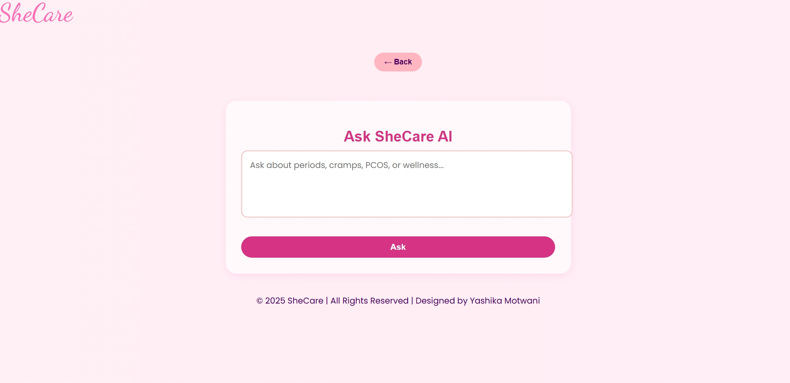
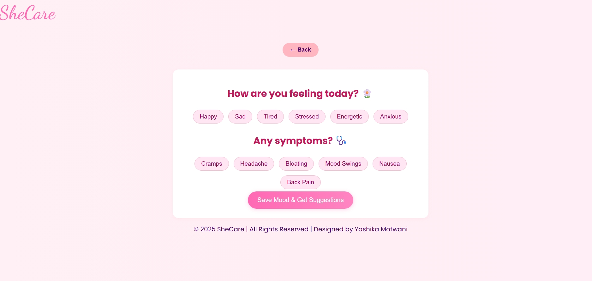
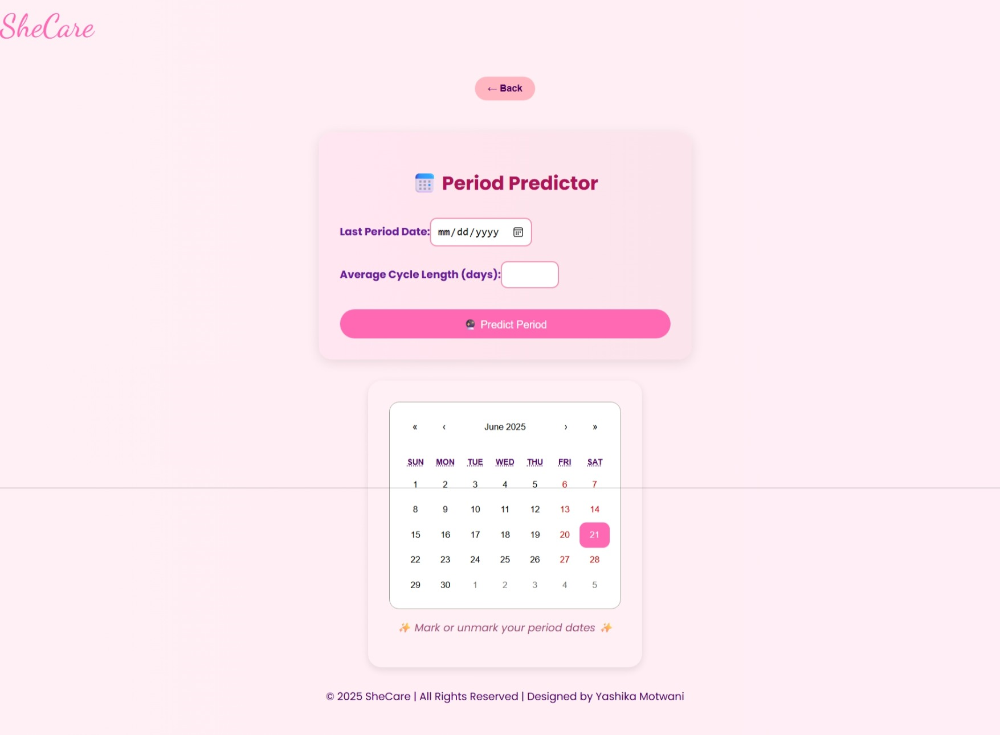

# 💗 SheCare - Women's Health Companion App

**SheCare** is a powerful and beautiful full-stack women's health companion app. Built using **React** (Frontend) and **Flask + Gemini AI** (Backend), it provides tools for mood tracking, period tracking, and AI-based support.

---

## Features

- 🩸 Period Tracker  
- 😄 Mood Logger & Mood Suggestions  
- 🤖 AskSheCare – AI Assistant using **Gemini**  
- 📱 Fully Responsive & Beautiful UI  
- 🔒 Local Data Handling & Real-time Chatbot


# SheCare 💖

## Screenshots

### AI Suggestions


### Ask SheCare Page


### Home Page


### Mood Suggestions


### Period Tracker


## Tech Stack
Frontend- React, CSS, HTML  
Backend  -Flask, Gemini API        |
Styling - Tailwind / Custom CSS    |
Hosting - GitHub / Render / Verce


##  Run Locally

### Backend (Flask + Gemini)

```bash
cd shecare-app/backend
pip install -r requirements.txt
python app.py
